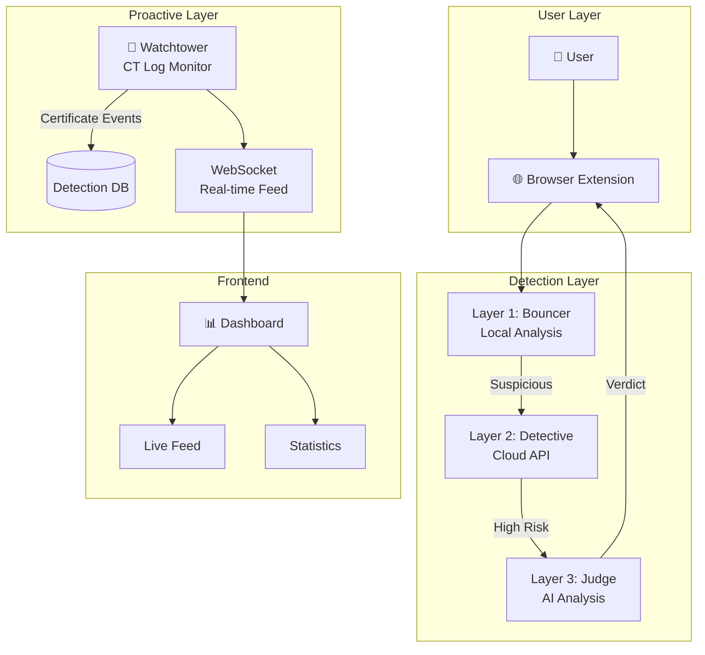

# 🛡️ SCAMMER HUNTER

**A comprehensive phishing detection and prevention system designed to protect Thai users from online scams.**


---

## 🎯 Overview

Scammer Hunter is a multi-layered defense system that detects and blocks phishing websites in real-time. It combines browser extension technology, cloud-based analysis, and Certificate Transparency log monitoring to provide proactive protection against online scams.

---

## 🏗️ Architecture



---

## 🔧 Components

### 1. 🌐 Browser Extension

Chrome extension that provides real-time page analysis:

- **Layer 1 (Bouncer)**: Local DOM analysis, form detection, suspicious keyword matching
- **Escalation**: Sends suspicious pages to cloud API for deeper analysis
- **User Alerts**: Visual warnings for detected phishing attempts

### 2. ☁️ Backend API (Flask)

Cloud-based detection service:

| Endpoint | Method | Description |
|----------|--------|-------------|
| `/analyze` | POST | Analyze URL for phishing indicators |
| `/api/watchtower/status` | GET | Get Watchtower monitoring status |
| `/api/watchtower/start` | POST | Start CT log monitoring |
| `/api/watchtower/stop` | POST | Stop CT log monitoring |
| `/api/watchtower/detections` | GET | Get recent detections (paginated) |
| `/api/watchtower/stats` | GET | Get aggregated statistics |
| `/api/watchtower/targets` | GET | Get list of monitored targets |

### 3. 🗼 Watchtower (CT Log Monitor)

Real-time Certificate Transparency log monitoring using DNSTwist-style algorithms:

```
┌─────────────────────────────────────────────────────────────┐
│                     WATCHTOWER v2.0                         │
├─────────────────────────────────────────────────────────────┤
│                                                             │
│   ┌─────────────┐    ┌─────────────┐    ┌─────────────┐    │
│   │  CertStream │───▶│   Fuzzer    │───▶│  Detection  │    │
│   │  (CT Logs)  │    │   Engine    │    │   Engine    │    │
│   └─────────────┘    └─────────────┘    └─────────────┘    │
│                                                │            │
│                           ┌────────────────────┘            │
│                           ▼                                 │
│   ┌─────────────┐    ┌─────────────┐    ┌─────────────┐    │
│   │  WebSocket  │◀───│   Stats     │◀───│   Alerts    │    │
│   │   Events    │    │   Tracker   │    │   System    │    │
│   └─────────────┘    └─────────────┘    └─────────────┘    │
│                                                             │
└─────────────────────────────────────────────────────────────┘
```

**Fuzzing Algorithms:**
- 🔀 Bitsquatting (single bit flips)
- 👁️ Homoglyphs (look-alike characters)
- ➖ Hyphenation (inserted hyphens)
- ➕ Insertion (extra characters)
- ➖ Omission (missing characters)
- 🔁 Repetition (doubled characters)
- 🔄 Replacement (keyboard typos)
- ↔️ Transposition (swapped characters)
- 🔤 Vowel swaps
- 📝 Common phishing additions

### 4. 📊 Frontend Dashboard (Next.js)

Real-time monitoring dashboard with:

- **Live Detection Feed**: Streaming phishing domain detections
- **Statistics Cards**: Certificates scanned, domains checked, detections
- **Target Breakdown**: Detection count by targeted brand
- **Attack Type Analysis**: Detection count by fuzzer type
- **Dark Mode UI**: Cybersecurity-themed interface

---

## 🎯 Monitored Targets

### Thai Banks
`kbank` `kasikornbank` `scb` `krungthai` `bangkokbank` `krungsri` `ttb` `gsb` `uob` `cimb` `lhbank`

### Government & Financial
`paotang` `thaichana` `promptpay` `baac`

### E-Wallets & Payment
`truemoney` `truewallet` `linepay` `shopeepay` `airpay` `bluepay`

---

## 🚀 Quick Start

### Prerequisites

- Python 3.9+
- Node.js 18+
- Chrome/Brave browser

### Backend Setup

```bash
cd backend

# Create virtual environment
python -m venv venv
venv\Scripts\activate  # Windows
source venv/bin/activate  # Linux/Mac

# Install dependencies
pip install -r requirements.txt

# Start server
python app.py
```

### Frontend Setup

```bash
cd frontend

# Install dependencies
npm install

# Start development server
npm run dev
```

### Extension Setup

1. Open Chrome and navigate to `chrome://extensions`
2. Enable "Developer mode"
3. Click "Load unpacked"
4. Select the `extension` folder

---

## 📡 WebSocket Events

The Watchtower emits real-time events via Socket.IO:

| Event | Payload | Description |
|-------|---------|-------------|
| `new_detection` | `Detection` object | New phishing domain detected |
| `stats_update` | `Stats` object | Updated statistics |
| `watchtower_error` | `{ error: string }` | Error notification |

---

## 🔒 Detection Scoring

Risk scores are calculated based on multiple factors:

| Factor | Score Impact |
|--------|--------------|
| Homoglyph/Bitsquatting attack | +40 |
| Addition/Hyphenation attack | +30 |
| Other typosquatting | +25 |
| Suspicious TLD (.xyz, .top, etc.) | +25 |
| Multiple hyphens | +15 |
| Security keywords (secure, verify, etc.) | +15 |
| Unusually long domain | +10 |
| Contains numbers | +5 |
| Direct keyword match | +20 |

**Risk Levels:**
- 🔴 **Critical** (70-100): High confidence phishing
- 🟠 **High** (50-69): Strong indicators
- 🟡 **Medium** (30-49): Moderate suspicion
- 🟢 **Low** (0-29): Minimal indicators

---

## 📁 Project Structure

```
scammer-hunter/
├── backend/
│   ├── app.py              # Flask API server
│   ├── watchtower.py       # CT log monitor
│   ├── watchtower_api.py   # WebSocket API
│   ├── fuzzer.py           # Domain fuzzing
│   ├── scam_hunter.py      # Hunter bot
│   └── requirements.txt    # Python dependencies
├── frontend/
│   ├── app/
│   │   ├── page.tsx        # Home page
│   │   ├── watchtower/
│   │   │   └── page.tsx    # Dashboard
│   │   └── globals.css     # Global styles
│   ├── package.json        # Node dependencies
│   └── next.config.ts      # Next.js config
├── extension/
│   ├── manifest.json       # Extension manifest
│   ├── background.js       # Service worker
│   └── content.js          # Content script
└── README.md               # This file
```

---

## 🛠️ Development

### Running Tests

```bash
# Backend tests
cd backend
python test_backend.py

# Watchtower test mode
python watchtower.py --test
```

### Generating Permutations

```bash
# Generate all permutations for a domain
python watchtower.py --generate kbank
```

---

## 🤝 Contributing

1. Fork the repository
2. Create a feature branch (`git checkout -b feature/amazing-feature`)
3. Commit your changes (`git commit -m 'Add amazing feature'`)
4. Push to the branch (`git push origin feature/amazing-feature`)
5. Open a Pull Request

---

## 📜 License

This project is licensed under the MIT License - see the [LICENSE](LICENSE) file for details.

---

## 🙏 Acknowledgments

- [Certstream](https://certstream.calidog.io/) - Real-time CT log streaming
- [DNSTwist](https://github.com/elceef/dnstwist) - Domain permutation algorithms
- [Next.js](https://nextjs.org/) - React framework
- [Tailwind CSS](https://tailwindcss.com/) - Styling

---

<div align="center">

**Built with ❤️ to protect Thai internet users**

</div>
